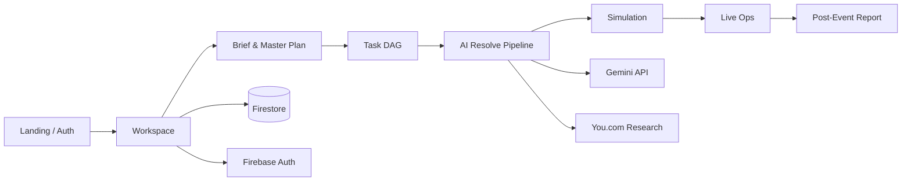

<div align="center">

# RunIT

**From one brief to full event execution — AI runs the ops, you run the show.**

*Brief → Master Plan → Simulate → Live Control Room → Report.*

[](https://nextjs.org/)
[](https://ai.google.dev/)
[](https://firebase.google.com/)
[](https://www.typescriptlang.org/)

[Get Started](#quick-start) · [Features](#features) · [AI Agents](#ai-agent-army) · [Deploy](#deploy) · [Docs](#documentation)

</div>

---

## The pitch

Event operators don't fail on ideas — they fail on **execution chaos**: scattered vendors, broken dependencies, last-minute fires, zero visibility.

**RunIT** is an **AI-native event execution system**. Drop a brief, get a dependency-mapped master plan, auto-resolve tasks with specialized agents, stress-test disasters before they happen, then command the whole operation from a live mission-control dashboard.

> Satu brief masuk. Master plan, vendor draft, simulasi krisis, dan laporan keluar — tanpa spreadsheet 47 tab.

---

## Features

| Stage | What you get |
|-------|----------------|
| **AI Panitia** | Source committee members & roles from your event context |
| **Brief → Master Plan** | Parse natural-language briefs into tasks, timelines & DAG |
| **Task Resolution** | 9 specialized agents resolve venue, vendor, sponsor, permit & more |
| **Auto-Resolve Pipeline** | Batch-resolve up to 50 tasks with confidence scores & draft comms |
| **Simulation** | AI-generated disruption scenarios + contingency plans |
| **Live Control Room** | Real-time DAG, confidence score, timeline adjuster |
| **Incident Response** | Crisis flows & fallback orchestration on demand |
| **Research & Sourcing** | You.com livecrawl + Gemini for vendor/sponsor intelligence |
| **Post-Event Report** | Auto-generated summaries, sponsor packs & reusable templates |
| **Execution Chat** | Copilot inside the workspace for on-the-fly ops decisions |

**Also packed in:** bilingual UI (EN/ID) · maps & venue picker · voice copilot · document generator · committee workspace · Firebase sync across devices

---

## AI Agent Army

Every task gets routed to the right brain — not one generic prompt for everything.

```
brief ──► classify ──► agent pick ──► You.com sourcing ──► Gemini resolve ──► draft + steps
```

| Agent | Handles |
|-------|---------|
| `venue` | Venues, capacity, location fit |
| `vendor` | Catering, AV, production vendors |
| `sponsor` | Sponsorship outreach & packages |
| `speaker` | Speakers, moderators, talent |
| `comms` | Announcements, social, PR drafts |
| `logistics` | Transport, load-in, routing |
| `permit` | Licenses, police, legal clearance |
| `crisis` | Risk mitigation & backup plans |
| `budget` | Cost estimates & negotiation tips |

Powered by **`lib/task-agents.ts`** + **`lib/gemini.ts`** with optional **`YOU_API_KEY`** for live web research.

---

## Architecture



**28+ API routes** under `app/api/ai/`, `app/api/search/`, and `app/api/dag/`.

---

## Tech stack

| Layer | Tools |
|-------|-------|
| **Frontend** | Next.js 16 App Router, React 19, Tailwind CSS 4, Framer Motion |
| **State** | Zustand + Firestore persistence |
| **AI** | Google Gemini (`@google/generative-ai`), specialized agent registry |
| **Research** | You.com API (optional livecrawl) |
| **Maps** | Leaflet / React-Leaflet |
| **Visualization** | React Flow (DAG), Recharts |
| **Backend** | Next.js Route Handlers + Firebase (Auth, Firestore, Storage) |
| **Deploy** | Firebase Hosting · `asia-southeast2` |

---

## Quick start

```bash
git clone https://github.com/0xAre/RunIT.git
cd RunIT
npm install
npm run dev
```

Open **[http://localhost:3000](http://localhost:3000)** → sign in → **New Project** → paste your event brief.

### Environment variables

Create `.env.local`:

```env
# Required — all AI routes
GEMINI_API_KEY=your_gemini_api_key

# Required — Firebase client
NEXT_PUBLIC_FIREBASE_API_KEY=
NEXT_PUBLIC_FIREBASE_AUTH_DOMAIN=
NEXT_PUBLIC_FIREBASE_PROJECT_ID=
NEXT_PUBLIC_FIREBASE_STORAGE_BUCKET=
NEXT_PUBLIC_FIREBASE_MESSAGING_SENDER_ID=
NEXT_PUBLIC_FIREBASE_APP_ID=

# Optional — web research & vendor sourcing
YOU_API_KEY=

# Optional — maps / places search
GOOGLE_MAPS_API_KEY=
```

| Variable | Purpose |
|----------|---------|
| `GEMINI_API_KEY` | Master plan, agents, simulation, reports, copilot |
| `NEXT_PUBLIC_FIREBASE_*` | Auth, Firestore sync, storage |
| `YOU_API_KEY` | Live web sourcing for venue/vendor/sponsor tasks |
| `GOOGLE_MAPS_API_KEY` | Geocode, places autocomplete, venue picker |

---

## Scripts

| Command | Description |
|---------|-------------|
| `npm run dev` | Dev server (webpack) |
| `npm run build` | Production build |
| `npm run start` | Run production server |
| `npm run lint` | ESLint |

---

## Project structure

```
app/
  api/ai/          # Gemini-powered endpoints (resolve, simulate, report, …)
  api/search/      # Maps, geocode, places, draft search
  api/dag/         # Dependency graph propagation
  workspace/         # Event ops UI (tasks, live, execution, master-plan, …)
  auth/            # Sign in / sign up
components/        # Shared UI + landing sections
hooks/             # Auth & client hooks
lib/               # gemini, task-agents, you, dag-engine, firebase, i18n
store/             # Zustand stores (events, language)
docs/              # Product docs (master plan vision, changelog, pitch script)
scripts/           # Local tooling (simulation, voiceover, tests)
public/            # Static assets & brand
```

---

## Deploy

Firebase Hosting (Southeast Asia):

```bash
firebase login
firebase deploy --only hosting,firestore:rules
```

Hosting site: **`runit`** · region **`asia-southeast2`** (see `firebase.json`).

---

## Documentation

| Doc | Description |
|-----|-------------|
| [Product vision doc](docs/runit_ai_event_execution_system_master_plan.md) | Full system design & master plan architecture |
| [V2 Changelog](docs/RUNIT_V2_CHANGELOG.md) | Milestone-by-milestone implementation notes |
| [Pitch Script](docs/PITCHING_SCRIPT.md) | Demo & video narrative |

---

## Built for operators who ship

RunIT is built for **hackathons, agencies, campus events, corporate activations, and anyone** who’s tired of rebuilding the same ops spreadsheet for every event.

**Brief in. Execution out. Chaos optional.**

---

<div align="center">

**[0xAre](https://github.com/0xAre)** · RunIT © 2026

*Powered by Gemini · Deployed on Google Cloud (Firebase)*

</div>
